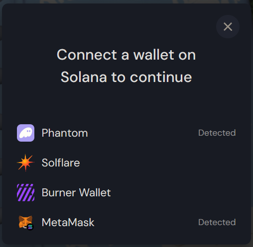

# Solana Wallet Connector
Solana wallet connector for your typescript app or vanilla JS. You can change the design of the modal. 


[npm](https://www.npmjs.com/package/solana-connect)



---

## Usage:

### If you use TypeScript

#### Installation
```batch
npm i @aiternate/solana-wallet-adapter-light
```

#### Usage

<details>
  <summary>Show code</summary>

  ```typescript
import { SolanaConnectLight } from "@aiternate/solana-wallet-adapter-light";
import { Adapter } from "@solana/wallet-adapter-base";

const solConnect = new SolanaConnectLight();

solConnect.openMenu();

solConnect.onWalletChange((adapter: Adapter | null) =>
  adapter
    ? console.log("connected:", adapter.name, adapter.publicKey.toString())
    : console.log("disconnected")
);

solConnect.onVisibilityChange((isOpen: boolean) => {
  console.log("menu visible:", isOpen);
});

const wallet: Adapter | null = solConnect.getWallet();
  ```
</details>

### If you use vanilla javascript
Use with [unpkg](https://www.unpkg.com/):

<details>
  <summary>Show code</summary>

  ```html
<!DOCTYPE html>
<html lang="en">
  <head>
    <script src="https://www.unpkg.com/@aiternate/solana-wallet-adapter-light"></script>
  </head>
  <body>
    <script>
      const solConnect = new window.SolanaConnectLight();
      solConnect.openMenu();
    </script>
  </body>
</html>
  ```
</details>

### Change automatic template
If you want to change the structure of the generated HTML, you must disable automatic HTML generation in the constructor of the `SolanaConnectLight`.

```typescript
new SolanaConnectLight({
    generateHtml: false
})
```
Then, in your HTML page, you must add the following lines to start. *You can find this in the JSDoc of the `generateHtml` property (just hover the property in VSCode).*

<details>
  <summary>Show html</summary>

  ```html
<div id="swal-modal" class="wallet-adapter-modal wallet-adapter-modal-fade-in ">
    <div class="wallet-adapter-modal-container">
        <div class="wallet-adapter-modal-wrapper">
            <button id="swal-close-btn" class="wallet-adapter-modal-button-close">
                <svg width="14" height="14">
                    <path d="M14 12.461 8.3 6.772l5.234-5.233L12.006 0 6.772 5.234 1.54 0 0 1.539l5.234 5.233L0 12.006l1.539 1.528L6.772 8.3l5.69 5.7L14 12.461z"></path>
                </svg>
            </button>
            <h1 class="wallet-adapter-modal-title">Connect a wallet on Solana to continue</h1>
            <ul id="swal-adapter-list" class="wallet-adapter-modal-list">
            </ul>
        </div>
    </div>
    <div class="wallet-adapter-modal-overlay"></div>
</div>
  ```
</details>

The importants elements here are `id="swal-modal"`, `id="swal-close-btn"` and `id="swal-adapter-list"`. You can change the structure as you want but theses ids must be used.

 - `id="swal-modal"`: Used to Display/Hide modal
 - `id="swal-close-btn"`: Used to bind the Hide action
 - `id="swal-adapter-list"`: Used to append adapters

To change adapters buttons html, you need to add the `addAdapterCallback` property to the `SolanaConnectConfig` object passed through the constructor of `SolanaConnectLight`. You can see below the default implementation of this property.
*You can find this in the JSDoc of the addAdapterCallback property (just hover the property in VSCode).*

<details>
  <summary>Show code</summary>

  ```typescript
    const solanaConnect = new SolanaConnectLight({
        addAdapterCallback: (wl) => {
            const liElement: HTMLElement = document.createElement('li');

        const buttonElement = document.createElement('button');
        buttonElement.classList.add('wallet-adapter-button');
        buttonElement.tabIndex = 0;
        buttonElement.type = 'button';

        const iconElement = document.createElement('i');
        iconElement.classList.add('wallet-adapter-button-start-icon');

        const imgElement = document.createElement('img');
        imgElement.src = wl.icon;
        iconElement.appendChild(imgElement);

        buttonElement.appendChild(iconElement);
        buttonElement.appendChild(document.createTextNode(wl.name));
        const spanElement = document.createElement('span');

        if (wl.readyState == 'Installed')
            spanElement.appendChild(document.createTextNode('Detected'));
        buttonElement.appendChild(spanElement);

        liElement.appendChild(buttonElement);

        return {
            elementToAppend: liElement,
            elementToBindConnectAction: buttonElement
        }
        },
    });
  ```
</details>

### Style definition
If you want your own modal design, you must disable automatic style generation in the constructor of the `SolanaConnectLight`.
```typescript
new SolanaConnectLight({
    generateStyle: false
})
```
Then, you can create your css file. It's advised to start with the following base.
*You can find this in the JSDoc of the `generateStyle` property (just hover the property in VSCode).*
    
<details>
  <summary>Show css</summary>
  
  ```css
    @import url('https://fonts.googleapis.com/css2?family=DM+Sans:wght@400;500;700&display=swap');

    .wallet-adapter-button {
        background-color: transparent;
        border: none;
        color: #fff;
        cursor: pointer;
        display: flex;
        align-items: center;
        font-family: 'DM Sans', 'Roboto', 'Helvetica Neue', Helvetica, Arial, sans-serif;
        font-size: 16px;
        font-weight: 600;
        height: 48px;
        line-height: 48px;
        padding: 0 24px;
        border-radius: 4px;
    }

    .wallet-adapter-button-trigger {
        background-color: #512da8;
    }

    .wallet-adapter-button:not([disabled]):focus-visible {
        outline-color: white;
    }

    .wallet-adapter-button:not([disabled]):hover {
        background-color: #1a1f2e;
    }

    .wallet-adapter-button[disabled] {
        background: #404144;
        color: #999;
        cursor: not-allowed;
    }

    .wallet-adapter-button-end-icon,
    .wallet-adapter-button-start-icon,
    .wallet-adapter-button-end-icon img,
    .wallet-adapter-button-start-icon img {
        display: flex;
        align-items: center;
        justify-content: center;
        width: 24px;
        height: 24px;
    }

    .wallet-adapter-button-end-icon {
        margin-left: 12px;
    }

    .wallet-adapter-button-start-icon {
        margin-right: 12px;
    }

    .wallet-adapter-collapse {
        width: 100%;
    }

    .wallet-adapter-dropdown {
        position: relative;
        display: inline-block;
    }

    .wallet-adapter-dropdown-list {
        position: absolute;
        z-index: 99;
        display: grid;
        grid-template-rows: 1fr;
        grid-row-gap: 10px;
        padding: 10px;
        top: 100%;
        right: 0;
        margin: 0;
        list-style: none;
        background: #2c2d30;
        border-radius: 10px;
        box-shadow: 0px 8px 20px rgba(0, 0, 0, 0.6);
        opacity: 0;
        visibility: hidden;
        transition: opacity 200ms ease, transform 200ms ease, visibility 200ms;
        font-family: 'DM Sans', 'Roboto', 'Helvetica Neue', Helvetica, Arial, sans-serif;
    }

    .wallet-adapter-dropdown-list-active {
        opacity: 1;
        visibility: visible;
        transform: translateY(10px);
    }

    .wallet-adapter-dropdown-list-item {
        display: flex;
        flex-direction: row;
        justify-content: center;
        align-items: center;
        border: none;
        outline: none;
        cursor: pointer;
        white-space: nowrap;
        box-sizing: border-box;
        padding: 0 20px;
        width: 100%;
        border-radius: 6px;
        font-size: 14px;
        font-weight: 600;
        height: 37px;
        color: #fff;
    }

    .wallet-adapter-dropdown-list-item:not([disabled]):hover {
        background-color: #1a1f2e;
    }

    .wallet-adapter-modal-collapse-button svg {
        align-self: center;
        fill: #999;
    }

    .wallet-adapter-modal-collapse-button.wallet-adapter-modal-collapse-button-active svg {
        transform: rotate(180deg);
        transition: transform ease-in 150ms;
    }

    .wallet-adapter-modal {
        display: none;
        position: fixed;
        top: 0;
        left: 0;
        right: 0;
        bottom: 0;
        opacity: 0;
        transition: opacity linear 150ms;
        background: rgba(0, 0, 0, 0.5);
        z-index: 1040;
        overflow-y: auto;
    }

    .wallet-adapter-modal.wallet-adapter-modal-fade-in {
        opacity: 1;
    }

    .wallet-adapter-modal-button-close {
        display: flex;
        align-items: center;
        justify-content: center;
        position: absolute;
        top: 18px;
        right: 18px;
        padding: 12px;
        cursor: pointer;
        background: #1a1f2e;
        border: none;
        border-radius: 50%;
    }

    .wallet-adapter-modal-button-close:focus-visible {
        outline-color: white;
    }

    .wallet-adapter-modal-button-close svg {
        fill: #777;
        transition: fill 200ms ease 0s;
    }

    .wallet-adapter-modal-button-close:hover svg {
        fill: #fff;
    }

    .wallet-adapter-modal-overlay {
        background: rgba(0, 0, 0, 0.5);
        position: fixed;
        top: 0;
        left: 0;
        bottom: 0;
        right: 0;
    }

    .wallet-adapter-modal-container {
        display: flex;
        margin: 3rem;
        min-height: calc(100vh - 6rem); /* 100vh - 2 * margin */
        align-items: center;
        justify-content: center;
    }

    @media (max-width: 480px) {
        .wallet-adapter-modal-container {
            margin: 1rem;
            min-height: calc(100vh - 2rem); /* 100vh - 2 * margin */
        }
    }

    .wallet-adapter-modal-wrapper {
        box-sizing: border-box;
        position: relative;
        display: flex;
        align-items: center;
        flex-direction: column;
        z-index: 1050;
        max-width: 400px;
        border-radius: 10px;
        background: #10141f;
        box-shadow: 0px 8px 20px rgba(0, 0, 0, 0.6);
        font-family: 'DM Sans', 'Roboto', 'Helvetica Neue', Helvetica, Arial, sans-serif;
        flex: 1;
    }

    .wallet-adapter-modal-wrapper .wallet-adapter-button {
        width: 100%;
    }

    .wallet-adapter-modal-title {
        font-weight: 500;
        font-size: 24px;
        line-height: 36px;
        margin: 0;
        padding: 64px 48px 48px 48px;
        text-align: center;
        color: #fff;
    }

    @media (max-width: 374px) {
        .wallet-adapter-modal-title {
            font-size: 18px;
        }
    }

    .wallet-adapter-modal-list {
        margin: 0 0 12px 0;
        padding: 0;
        width: 100%;
        list-style: none;
    }

    .wallet-adapter-modal-list .wallet-adapter-button {
        font-weight: 400;
        border-radius: 0;
        font-size: 18px;
    }

    .wallet-adapter-modal-list .wallet-adapter-button-end-icon,
    .wallet-adapter-modal-list .wallet-adapter-button-start-icon,
    .wallet-adapter-modal-list .wallet-adapter-button-end-icon img,
    .wallet-adapter-modal-list .wallet-adapter-button-start-icon img {
        width: 28px;
        height: 28px;
    }

    .wallet-adapter-modal-list .wallet-adapter-button span {
        margin-left: auto;
        font-size: 14px;
        opacity: .6;
    }

    .wallet-adapter-modal-list-more {
        cursor: pointer;
        border: none;
        padding: 12px 24px 24px 12px;
        align-self: flex-end;
        display: flex;
        align-items: center;
        background-color: transparent;
        color: #fff;
    }

    .wallet-adapter-modal-list-more svg {
        transition: all 0.1s ease;
        fill: rgba(255, 255, 255, 1);
        margin-left: 0.5rem;
    }

    .wallet-adapter-modal-list-more-icon-rotate {
        transform: rotate(180deg);
    }

    .wallet-adapter-modal-middle {
        width: 100%;
        display: flex;
        flex-direction: column;
        align-items: center;
        padding: 0 24px 24px 24px;
        box-sizing: border-box;
    }

    .wallet-adapter-modal-middle-button {
        display: block;
        cursor: pointer;
        margin-top: 48px;
        width: 100%;
        background-color: #512da8;
        padding: 12px;
        font-size: 18px;
        border: none;
        border-radius: 8px;
        color: #fff;
    }
  ```
</details>

##  Adding more adapters:
By default, only wallets that support the [Wallet Standard](https://github.com/wallet-standard/wallet-standard) will appear, but additional options can be provided.

```typescript
import {
SolanaMobileWalletAdapter,
createDefaultAuthorizationResultCache,
createDefaultAddressSelector,
createDefaultWalletNotFoundHandler,
} from "@solana-mobile/wallet-adapter-mobile";
import { SolflareWalletAdapter } from "@solana/wallet-adapter-solflare";
import { UnsafeBurnerWalletAdapter } from "@solana/wallet-adapter-unsafe-burner";

const solConnect = new SolanaConnectLight({
additionalAdapters: [
    new SolflareWalletAdapter(),
    new UnsafeBurnerWalletAdapter(),
    new SolanaMobileWalletAdapter({
    addressSelector: createDefaultAddressSelector(),
    appIdentity: {
        name: "Supercorp",
        uri: "https://supercorp.app/",
        icon: "icon.png",
    },
    authorizationResultCache: createDefaultAuthorizationResultCache(),
    cluster: "mainnet-beta",
    onWalletNotFound: createDefaultWalletNotFoundHandler(),
    }),
],
});
```